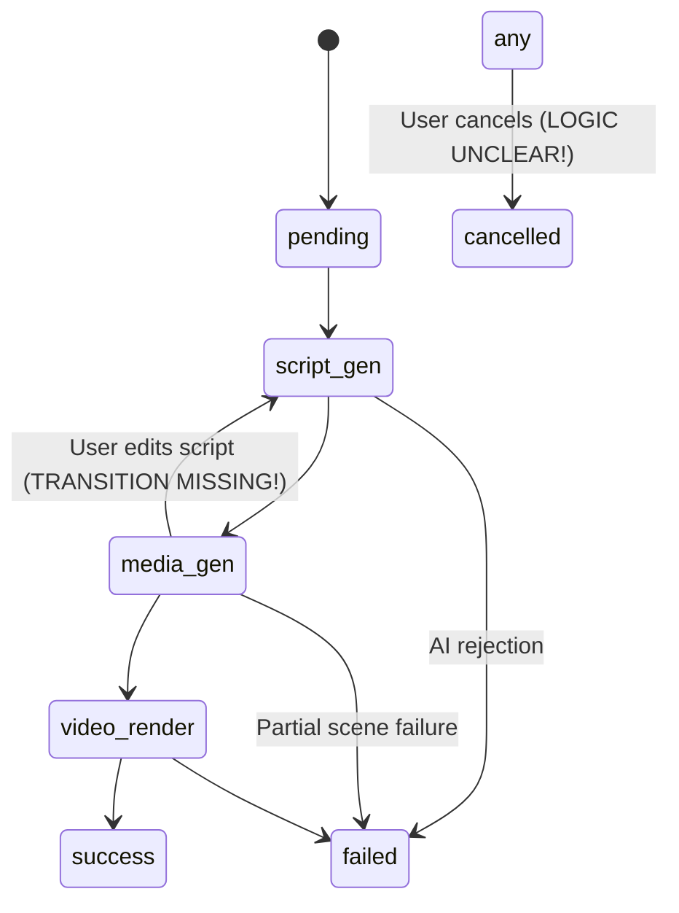

# Marketing2 - Architectural Review Report

**Reviewer**: Senior Software Architect & Product Manager  
**Date**: 2025-02-02  
**Branch**: `design/technical-spec`  
**Documents Reviewed**: `TECHNICAL_DESIGN.md`, `UI_UX_DESIGN.md`

---

## Executive Summary

The technical design demonstrates solid foundation with modern stack choices (FastAPI, Celery, PostgreSQL). However, **critical architectural risks exist** in concurrency handling, error recovery, and data consistency. The "1 paragraph → 3 scenes" fan-out pattern requires significant hardening to prevent cascading failures.

**Risk Level**: 🟡 **MODERATE-HIGH** (requires immediate attention before implementation)

---

## 1. Concurrency & Task Orchestration

### 🔴 **CRITICAL ISSUE**: Celery Group Task Failure Handling

**Problem Identified:**
```python
# From TECHNICAL_DESIGN.md Section 4.2
# "并行素材生成 (Parallel Asset Generation)"
# → "**Group 任务**: 为每个 Scene 创建子任务。"
```

**Risk**: Celery's `group()` primitive has **no built-in partial failure recovery**. If 1 out of 10 scenes fails (e.g., sensitive content block), the entire group task may hang or fail silently.

**Evidence**:
- Design states: "若 API 返回敏感拦截，标记该 Scene 为 Error"
- But **who** marks it? If a Celery task raises an exception, it won't update DB unless wrapped properly
- No mention of `link_error` callbacks or result backends

**Edge Cases Not Covered**:
1. **Partial success scenario**: 8/10 scenes generated → Should we allow video render with missing scenes or fail entire task?
2. **Timeout handling**: If Wanx-v1 API hangs for 2 minutes, will other scenes wait indefinitely?
3. **Redis broker failure mid-group**: Tasks may be lost without acknowledgment

**Recommendation**:
```python
# Use chord() with explicit error handling
from celery import chord, group
from celery.exceptions import SoftTimeLimitExceeded

# Each scene task MUST have:
@app.task(bind=True, max_retries=0, soft_time_limit=120)
def generate_scene_assets(self, scene_id):
    try:
        # ... generation logic
    except SensitiveContentError as e:
        # Update DB immediately before raising
        Scene.update(scene_id, status='error', error_msg=str(e))
        return {'scene_id': scene_id, 'status': 'error'}
    except SoftTimeLimitExceeded:
        Scene.update(scene_id, status='timeout')
        return {'scene_id': scene_id, 'status': 'timeout'}
    return {'scene_id': scene_id, 'status': 'success'}

# Use chord to collect results
callback = finalize_video.s(task_id)
chord(
    [generate_scene_assets.s(scene.id) for scene in scenes],
    callback
).apply_async()

@app.task
def finalize_video(results, task_id):
    # Explicit partial failure handling
    failed = [r for r in results if r['status'] != 'success']
    if failed:
        Task.update(task_id, status='partial_failure', error_scenes=failed)
        # Notify user via SSE
```

**Action Items**:
- [ ] Add explicit timeout to ALL external API calls (Qwen, Wanx, Sambert)
- [ ] Implement `on_failure` callback for every Celery task
- [ ] Define partial failure policy: Fail-fast vs. Best-effort rendering

---

### ⚠️ **WARNING**: Redis Pub/Sub for SSE is Fragile

**Problem**:
```mermaid
Worker -> Redis PUBLISH -> FastAPI SUBSCRIBE -> SSE to User
```

**Risks**:
1. **No message persistence**: If FastAPI restarts during generation, all pending SSE events are lost
2. **No backpressure**: If user's browser disconnects, Worker keeps publishing to void
3. **Race condition**: SSE client connects AFTER Worker publishes "task_started" event

**Recommendation**:
Use **Redis Streams** instead of Pub/Sub:
```python
# Worker publishes to stream (persisted)
redis.xadd(f'task:{task_id}:events', {
    'type': 'progress',
    'data': json.dumps({'percent': 45, 'step': 'image_gen'})
})

# FastAPI reads from last_id on reconnect
async def sse_stream(task_id, last_event_id='0-0'):
    while True:
        events = await redis.xread({f'task:{task_id}:events': last_event_id}, count=10)
        for event_id, data in events:
            yield f"id: {event_id}\ndata: {data}\n\n"
            last_event_id = event_id
```

**Benefits**:
- ✅ Client can resume from last received event ID
- ✅ Events persist for 24h (configurable TTL)
- ✅ Worker doesn't need to know if anyone is listening

---

## 2. Error Handling & Recovery

### 🔴 **CRITICAL GAP**: No Retry Budget System

**Problem Identified:**
```
"敏感内容: AI 接口报错直接透传，不自动重试，交由用户人工干预。"
```

**Risk**: **Permanent failure on transient errors**

**Scenario**:
```
Scene 5/10: Wanx-v1 returns HTTP 429 (Rate Limit) at 23:59
→ Task marks scene as "error"
→ User sees "Generation failed"
→ User clicks "Retry entire task"
→ Wastes $$$ regenerating Scenes 1-4 that already succeeded
```

**Missing Logic**:
1. **Transient vs. Permanent errors** not distinguished
   - Transient: `429 Rate Limit`, `503 Service Unavailable`, Network timeout
   - Permanent: `SENSITIVE_CONTENT_DETECTED`, `QUOTA_EXCEEDED`
2. **No exponential backoff** for rate limits
3. **No scene-level retry** (only task-level retry via UI)

**Recommendation**:
```python
# Use tenacity library (mentioned in Section 5)
from tenacity import retry, stop_after_attempt, wait_exponential, retry_if_exception_type

class TransientAPIError(Exception):
    pass

class PermanentAPIError(Exception):
    pass

@retry(
    retry=retry_if_exception_type(TransientAPIError),
    stop=stop_after_attempt(3),
    wait=wait_exponential(multiplier=2, min=4, max=60)
)
def call_wanx_api(prompt):
    try:
        response = wanx_client.generate(prompt)
        if response.status_code == 429:
            raise TransientAPIError("Rate limit hit")
        elif response.status_code == 451:  # Sensitive content
            raise PermanentAPIError(response.error_message)
        return response.image_url
    except requests.Timeout:
        raise TransientAPIError("Network timeout")
```

**Action Items**:
- [ ] Categorize all Aliyun API error codes into Transient/Permanent
- [ ] Add `retry_count` field to `scenes` table
- [ ] Implement UI affordance: "Retry Scene 5" instead of "Retry All"

---

### ⚠️ **WARNING**: Sensitive Content Handling is Incomplete

**Problem**:
Design says "交由用户人工干预" but UI_UX_DESIGN.md shows:
```
🔴 Error (失败 - 点击重试)
```

**Gap**: **What should user retry with?** If original prompt triggered filter, retrying identical prompt will fail again.

**Missing Requirements**:
1. Show **which keyword triggered filter** (if Aliyun provides it)
2. Suggest **alternative phrasings** (e.g., "武器" → "道具")
3. Allow **manual prompt override** before retry
4. Option to **skip problematic scene** and continue

**Recommendation**:
```typescript
// UI Component: ErrorSceneCard.vue
interface SensitiveContentError {
  scene_id: string;
  original_prompt: string;
  flagged_keywords: string[];  // From Aliyun response
  suggested_fix: string;       // AI-generated safe alternative
  actions: {
    'edit_prompt': boolean;
    'skip_scene': boolean;
    'use_placeholder': boolean; // Use a generic image
  }
}
```

---

## 3. Data Consistency & Race Conditions

### 🟡 **MODERATE RISK**: Missing DB Transaction Boundaries

**Problem Identified:**
Schema design shows proper foreign keys, but no discussion of transaction isolation.

**Vulnerable Operation** (from Section 4.2):
```
1. FastAPI creates Task (status='pending')
2. FastAPI creates 10 Scene records
3. FastAPI pushes to Celery
4. Worker updates Task.status to 'script_gen'
5. **Concurrent request**: GET /api/v1/workflow/{task_id}
   → Reads Task.status = 'script_gen' but Scenes still show status=NULL
```

**Race Condition**:
```sql
-- FastAPI transaction (not committed yet)
BEGIN;
INSERT INTO tasks (...) VALUES (...);  
INSERT INTO scenes (...) VALUES (...);  -- 10 rows
COMMIT;  -- But before this...

-- Worker transaction (already started!)
BEGIN;
UPDATE tasks SET status='script_gen' WHERE id=...;
-- Tries to UPDATE scenes WHERE task_id=...
-- May see 0 rows if FastAPI hasn't committed!
COMMIT;
```

**Recommendation**:
```python
# Use SQLAlchemy async transaction context
async with db.begin():  # Ensures atomicity
    task = Task(id=uuid4(), status='pending')
    db.add(task)
    await db.flush()  # Get task.id before creating scenes
    
    scenes = [Scene(task_id=task.id, sequence=i) for i in range(len(script))]
    db.add_all(scenes)
    # Commit happens when context exits

# Worker waits for task to be visible
@app.task
def process_task(task_id):
    task = Task.get_or_wait(task_id, timeout=5)  # Poll with timeout
    if not task:
        raise TaskNotFoundError()
```

**Action Items**:
- [ ] Audit all multi-table operations for proper transaction wrapping
- [ ] Use `SELECT ... FOR UPDATE` when updating task status from multiple workers
- [ ] Add database migration tests to verify foreign key constraints

---

### 🟡 **MODERATE RISK**: Missing Idempotency on Regenerate Operations

**Problem**:
API design includes:
```
POST /api/v1/scenes/{scene_id}/regenerate_image
POST /api/v1/scenes/{scene_id}/regenerate_audio
```

**Scenario**:
```
User clicks "🔄 重绘" button
→ Frontend sends POST /regenerate_image
→ Network glitch: Browser times out
→ User clicks again (double-submit)
→ 2 Celery tasks queued for same scene
→ $$$ wasted on duplicate API calls
```

**Missing Design**:
- No idempotency key in request
- No check if regeneration is already in progress
- No UI disabled state during regeneration

**Recommendation**:
```python
# Add idempotency check
@router.post("/scenes/{scene_id}/regenerate_image")
async def regenerate_image(scene_id: UUID, idempotency_key: str = Header(None)):
    scene = await Scene.get(scene_id)
    
    # Check if already processing
    if scene.status == 'regenerating':
        existing_task = await redis.get(f'regen:{scene_id}')
        if existing_task:
            return {"task_id": existing_task, "status": "already_processing"}
    
    # Store idempotency key
    if idempotency_key:
        cached = await redis.get(f'idempotent:{idempotency_key}')
        if cached:
            return cached  # Return previous result
    
    task = regenerate_scene_image.apply_async((scene_id,))
    await redis.setex(f'regen:{scene_id}', 300, task.id)
    
    result = {"task_id": task.id, "status": "queued"}
    if idempotency_key:
        await redis.setex(f'idempotent:{idempotency_key}', 3600, json.dumps(result))
    
    return result
```

---

## 4. UX Flow & Human-in-the-Loop

### ⚠️ **WARNING**: Missing State Machine Definition

**Problem**:
Status enum defined as:
```
`pending`, `script_gen`, `media_gen`, `video_render`, `success`, `failed`
```

**But transitions not specified**:
- Can task go from `media_gen` back to `script_gen` if user edits script?
- If user cancels during `video_render`, can they resume or must restart?
- What happens to child scenes when parent task is `cancelled`?

**Missing State Diagram**:


**Recommendation**:
Define explicit state transition rules:
```python
# In models.py
class TaskStatus(str, Enum):
    PENDING = 'pending'
    SCRIPT_GEN = 'script_gen'
    MEDIA_GEN = 'media_gen'
    VIDEO_RENDER = 'video_render'
    SUCCESS = 'success'
    FAILED = 'failed'
    CANCELLED = 'cancelled'
    PAUSED = 'paused'  # NEW: For human intervention

ALLOWED_TRANSITIONS = {
    TaskStatus.PENDING: [TaskStatus.SCRIPT_GEN, TaskStatus.CANCELLED],
    TaskStatus.SCRIPT_GEN: [TaskStatus.MEDIA_GEN, TaskStatus.FAILED, TaskStatus.PAUSED],
    TaskStatus.MEDIA_GEN: [TaskStatus.VIDEO_RENDER, TaskStatus.PAUSED, TaskStatus.FAILED],
    TaskStatus.PAUSED: [TaskStatus.SCRIPT_GEN, TaskStatus.MEDIA_GEN],  # Resume
    # ...
}

def transition_to(task, new_status):
    if new_status not in ALLOWED_TRANSITIONS[task.status]:
        raise InvalidStateTransition(f"Cannot go from {task.status} to {new_status}")
    task.status = new_status
```

---

### 🟡 **MODERATE GAP**: Editing Script Mid-Generation Not Specified

**User Story**:
```
1. User submits novel text
2. Script optimization completes → Shows 10 scenes
3. User sees Scene 3's script is weird → Edits the text
4. ???
```

**Questions Design Doesn't Answer**:
- Does editing invalidate all 10 scenes or just Scene 3?
- If Scene 3 was already generating image, does editing cancel that task?
- How to handle version conflicts (user edits while worker updates same row)?

**Recommendation**:
Add versioning to scenes:
```python
class Scene(Base):
    # ...
    version = Column(Integer, default=1)  # Optimistic locking
    edited_at = Column(DateTime, nullable=True)
    
@router.put("/scenes/{scene_id}")
async def update_scene(scene_id: UUID, data: SceneUpdate, expected_version: int):
    scene = await Scene.get(scene_id)
    if scene.version != expected_version:
        raise ConflictError("Scene was modified by another process")
    
    # Cancel any in-flight regeneration task
    task_id = await redis.get(f'regen:{scene_id}')
    if task_id:
        app.control.revoke(task_id, terminate=True)
    
    scene.script_text = data.script_text
    scene.version += 1
    scene.edited_at = datetime.utcnow()
    # Invalidate downstream assets
    scene.image_url = None
    scene.audio_url = None
    await db.commit()
```

---

## 5. Performance & Scalability Bottlenecks

### 🔴 **CRITICAL**: FFmpeg Video Rendering is Single-Threaded

**Problem**:
```yaml
worker-video: Celery (Concurrency: 1)  # From Section 7
```

**Math**:
- 1 paragraph = 3 scenes
- Novel (5000 chars) ≈ 10 paragraphs = 30 scenes
- FFmpeg render per scene: ~5-10 seconds
- Total render time: 30 scenes × 8s = **4 minutes**

**Bottleneck**:
With concurrency=1, the entire video pipeline is serialized. If 5 users submit tasks simultaneously:
```
User 1: 0-4 min
User 2: 4-8 min  (waits 4 min to start!)
User 3: 8-12 min
...
```

**Why Not Parallelize?**:
Design says "CPU 密集型任务" but modern servers have 8+ cores. FFmpeg can run 4 concurrent renders safely.

**Recommendation**:
```yaml
# docker-compose.yml
worker-video:
  image: marketing2-worker
  command: celery -A app worker -Q video_processing -c 4 --max-tasks-per-child=10
  deploy:
    resources:
      limits:
        cpus: '4.0'
        memory: 8G
```

**Add resource monitoring**:
```python
@app.task(bind=True)
def render_video(self, scenes):
    # Check available memory before starting
    mem = psutil.virtual_memory()
    if mem.percent > 85:
        self.retry(countdown=60)  # Wait for memory to free up
```

---

### ⚠️ **WARNING**: No Asset Cleanup Strategy

**Problem**:
Design shows output saved to:
```
Storage[Local FS / OSS]
```

But no mention of:
- Temporary file cleanup after video render
- Failed task artifact deletion
- User-cancelled task cleanup
- Disk space monitoring

**Scenario**:
```
User generates 100 videos
Each has: 30 scenes × (1 image + 1 audio + 1 video clip) = 90 files
Total: 100 × 90 = 9,000 files
Failed renders leave orphaned files
Disk fills up → New tasks fail
```

**Recommendation**:
```python
# Add cleanup tasks
@app.task
def cleanup_failed_task(task_id):
    task = Task.get(task_id)
    if task.status == 'failed':
        scenes = Scene.filter(task_id=task_id)
        for scene in scenes:
            # Delete temp files
            if scene.image_url and scene.image_url.startswith('/tmp/'):
                os.remove(scene.image_url)
            # Keep only final video for debugging
        
        # Update storage stats
        redis.incr('storage:freed_bytes', calculated_size)

# Schedule periodic cleanup
@app.on_after_configure.connect
def setup_periodic_tasks(sender, **kwargs):
    sender.add_periodic_task(
        3600.0,  # Every hour
        cleanup_old_tasks.s(),
    )
```

---

## 6. Security & Abuse Prevention

### 🔴 **CRITICAL**: No Rate Limiting on Expensive Endpoints

**Problem**:
Design states "Single User Mode" but doesn't define:
- Max concurrent tasks per user/IP
- Max API calls per day
- Cost budget limits

**Abuse Scenario**:
```
Malicious user discovers endpoint
while true; do
  curl -X POST /api/v1/workflow/create -d '{"novel_text": "..."}'
done

→ Spawns 1000 tasks in 1 minute
→ Queue depth: 30,000 scenes to generate
→ Aliyun bill: ¥50,000+ in API calls
```

**Missing Protection**:
- No IP-based rate limiting (even in single-user mode, prevent accidental loops)
- No task queue depth limit
- No cost estimation before task creation

**Recommendation**:
```python
from slowapi import Limiter
from slowapi.util import get_remote_address

limiter = Limiter(key_func=get_remote_address)

@app.post("/api/v1/workflow/create")
@limiter.limit("5/minute")  # Max 5 tasks per minute
async def create_task(request: Request, data: CreateTaskRequest):
    # Check queue depth
    queue_size = await redis.llen('celery')
    if queue_size > 100:
        raise HTTPException(503, "System overloaded, try again later")
    
    # Estimate cost
    estimated_scenes = len(data.novel_text) // 150  # Rough heuristic
    estimated_cost = estimated_scenes * (0.05 + 0.02 + 0.08)  # Image+TTS+LLM
    
    if estimated_cost > 50:  # ¥50 limit
        raise HTTPException(400, f"Estimated cost ¥{estimated_cost} exceeds limit")
    
    # ... proceed with task creation
```

---

## 7. Testing & Observability Gaps

### ⚠️ **WARNING**: No Monitoring/Alerting Strategy

**Missing Metrics**:
- Task success/failure rate
- Average generation time per scene
- API error rate (Qwen, Wanx, Sambert)
- Queue depth & worker saturation
- Disk I/O during FFmpeg rendering

**Recommendation**:
Add Prometheus + Grafana:
```python
from prometheus_client import Counter, Histogram

task_counter = Counter('tasks_total', 'Total tasks', ['status'])
scene_duration = Histogram('scene_generation_seconds', 'Scene generation time', ['step'])

@app.task
def generate_scene(scene_id):
    with scene_duration.labels(step='image').time():
        image_url = call_wanx_api(...)
    
    task_counter.labels(status='success').inc()
```

**Alert Rules**:
```yaml
groups:
  - name: marketing2
    rules:
      - alert: HighFailureRate
        expr: rate(tasks_total{status="failed"}[5m]) > 0.1
        annotations:
          summary: "More than 10% of tasks failing"
      
      - alert: SlowVideoRender
        expr: scene_generation_seconds{step="video",quantile="0.95"} > 30
        annotations:
          summary: "95th percentile video render >30s"
```

---

## 8. Missing Requirements / Assumptions

### 📋 Not Addressed in Design

1. **Multi-language Support**: Design assumes Chinese, but what if novel_text is English?
2. **BGM Copyright**: "内置 5 首免版权音乐" - Where are these sourced? License verified?
3. **Accessibility**: No mention of subtitles for hearing-impaired (though hardsubs exist for visual)
4. **Mobile Responsiveness**: UI_UX shows desktop layout, but what about phone access?
5. **Export Formats**: Only MP4 mentioned - what about GIF preview, or platform-specific formats (TikTok vs YouTube)?
6. **Analytics**: No user behavior tracking (which novels convert best? Which BGM is popular?)

---

## Actionable Recommendations Summary

### 🚨 Must Fix Before Implementation (P0)
1. **Implement chord-based error handling** for scene generation group tasks
2. **Add retry logic** with transient/permanent error categorization  
3. **Switch from Pub/Sub to Redis Streams** for SSE reliability
4. **Add rate limiting** to prevent runaway costs
5. **Define state transition rules** for task lifecycle

### ⚠️ Should Fix in MVP (P1)
6. **Add idempotency keys** to regeneration endpoints
7. **Implement disk cleanup** strategy for temp files
8. **Increase FFmpeg worker concurrency** to 4
9. **Add scene versioning** for edit conflicts
10. **Add basic monitoring** (Prometheus metrics)

### 💡 Nice to Have (P2)
11. **Add cost estimation** UI before task creation
12. **Implement partial failure recovery** (render with available scenes)
13. **Add alert system** for high failure rates
14. **Multi-language detection** in script optimization
15. **Export format options** (MP4, GIF, WebM)

---

## Conclusion

The design demonstrates **solid architectural thinking** but has **implementation gaps** that could cause production failures. The "1 paragraph → 3 scenes" fan-out is the highest risk area.

**Greenlight Status**: 🟡 **CONDITIONAL APPROVAL**  
Proceed to implementation ONLY after addressing P0 issues.

**Estimated Hardening Effort**: 3-4 additional days  
**Risk Reduction**: HIGH → LOW

---

*Report compiled by Red (AI Butler) - Architecture Review Service*  
*Timestamp*: 2025-02-02 11:45 CST
