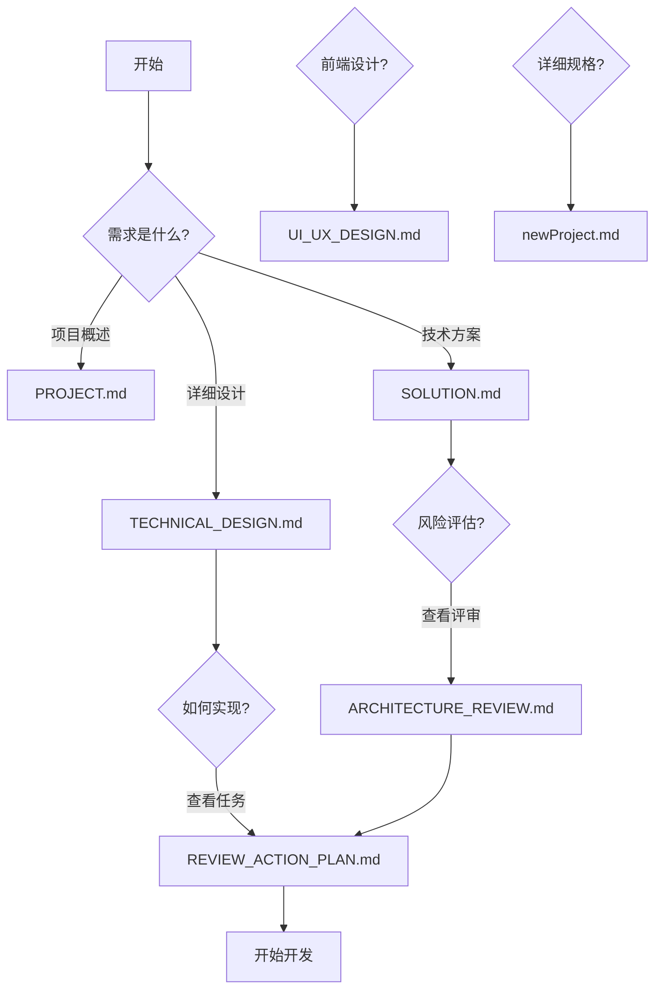

# Marketing2 - AI 营销自动化平台

> **项目定位**: 将小说文本自动转换为 AI 漫画式短视频的自动化工具

## 📚 核心文档

### 快速开始
- **[PROJECT.md](PROJECT.md)** - 项目需求、功能模块与 MVP 目标
- **[SOLUTION.md](SOLUTION.md)** - 技术方案、架构设计与验收标准

### 技术设计（最新）
- **[TECHNICAL_DESIGN.md](TECHNICAL_DESIGN.md)** - 详细技术架构、数据库 Schema、API 规范
- **[ARCHITECTURE_REVIEW.md](ARCHITECTURE_REVIEW.md)** - 架构评审报告、风险识别与解决方案
- **[UI_UX_DESIGN.md](UI_UX_DESIGN.md)** - 视觉设计规范、交互原型与色彩系统

### 执行计划
- **[REVIEW_ACTION_PLAN.md](REVIEW_ACTION_PLAN.md)** - P0/P1 任务清单、开发排期与 Checklists

### 详细规格
- **[newProject.md](newProject.md)** - 完整功能规格、组件定义与业务逻辑

## 🚀 技术栈

**前端**: Vue 3 + TypeScript + Vite + Pinia + TailwindCSS
**后端**: FastAPI + Celery + Redis + PostgreSQL
**AI 服务**: 通义千问 (LLM) + 通义万相 (绘图) + 阿里 Sambert (TTS)
**视频处理**: FFmpeg

## 📊 开发状态

**当前分支**: `local-building` - 优化后的技术方案分支

**最新更新** (2026-02-02):
- ✅ 统一数据模型定义（JSONB 结构）
- ✅ 统一状态枚举定义（细粒度状态）
- ✅ 修复文档日期和分支引用
- ✅ 补充小说爬取技术细节
- ✅ 架构评审识别 5 个 P0 风险并给出解决方案

## 🎯 MVP 范围

- 一键视频生成（小说文本 → 完整视频）
- 分步工作流（5 步独立操作）
- 章节提取功能
- 小说爬取（2-3 站点）
- 实时进度推送（SSE）

**预估完成时间**: 3-4 周

## 📖 文档导航



## 🏗️ 项目结构

```
Marketing2/
├── 📘 核心文档
│   ├── PROJECT.md              # 项目需求
│   ├── SOLUTION.md             # 技术方案
│   ├── TECHNICAL_DESIGN.md      # 技术设计 ⭐
│   ├── ARCHITECTURE_REVIEW.md   # 架构评审 ⭐
│   ├── UI_UX_DESIGN.md          # UI/UX 设计 ⭐
│   └── REVIEW_ACTION_PLAN.md    # 行动计划 ⭐
│
├── 📙 详细规格
│   └── newProject.md            # 功能规格
│
├── backend/                     # 后端代码（待开发）
├── frontend/                    # 前端代码（待开发）
└── .sisyphus/                   # 开发计划
    └── plans/ai-video-platform.md
```

## 📝 License

See [LICENSE](LICENSE) file.
