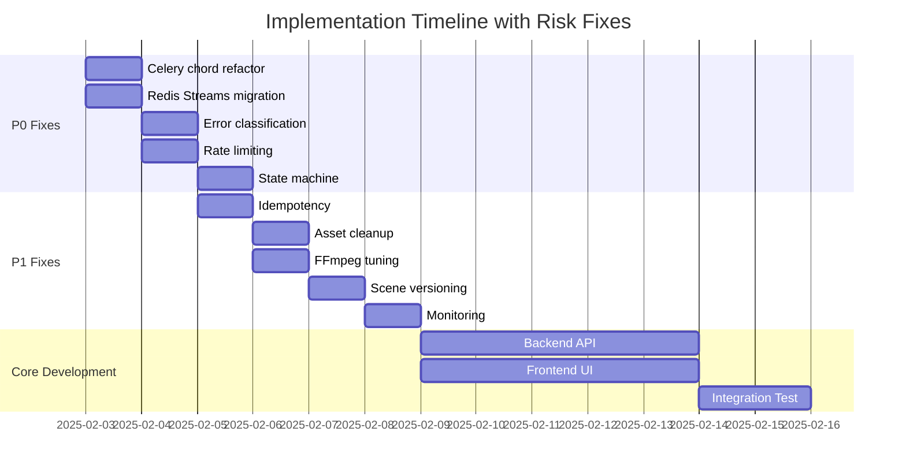

# Architecture Review - Action Plan

**Review Date**: 2026-02-02
**Full Report**: See `ARCHITECTURE_REVIEW.md`
**Branch**: `local-building`

---

## Critical Issues (Fix Before Code) - P0

### 1. Celery Group Task Failure Handling ⏱️ 1 day
**Risk**: Cascading failures when scenes fail mid-generation  
**Solution**: Replace `group()` with `chord()` + explicit error callbacks  
**Files**: `backend/tasks/scene_generation.py`

### 2. Redis Pub/Sub → Streams Migration ⏱️ 0.5 day
**Risk**: SSE events lost on reconnect  
**Solution**: Use `XREAD` for persistent event streaming  
**Files**: `backend/api/sse.py`, `backend/tasks/base.py`

### 3. Error Classification System ⏱️ 0.5 day
**Risk**: Permanent failures on transient errors (rate limits)  
**Solution**: Categorize API errors + exponential backoff  
**Files**: `backend/services/aliyun_client.py`

### 4. Rate Limiting ⏱️ 0.5 day
**Risk**: Runaway API costs from abuse/loops  
**Solution**: Add `slowapi` middleware  
**Files**: `backend/main.py`, `backend/api/workflow.py`

### 5. State Machine Definition ⏱️ 0.5 day
**Risk**: Undefined task lifecycle transitions  
**Solution**: Explicit state transition rules in models  
**Files**: `backend/models/task.py`

**Total P0 Effort**: ~3 days

---

## High Priority (Include in MVP) - P1

### 6. Idempotency for Regeneration ⏱️ 0.5 day
**Files**: `backend/api/scenes.py`

### 7. Asset Cleanup Strategy ⏱️ 1 day
**Files**: `backend/tasks/cleanup.py`, `docker-compose.yml` (cron service)

### 8. FFmpeg Concurrency Tuning ⏱️ 0.5 day
**Files**: `docker-compose.yml`, `backend/tasks/video_render.py`

### 9. Scene Edit Versioning ⏱️ 1 day
**Files**: `backend/models/scene.py`, `backend/api/scenes.py`

### 10. Basic Monitoring ⏱️ 1 day
**Files**: `backend/monitoring.py`, `prometheus.yml`, `grafana/dashboards/`

**Total P1 Effort**: ~4 days

---

## Code Review Checklist (During Implementation)

```markdown
### Every Celery Task Must Have:
- [ ] `@task(bind=True, max_retries=X, soft_time_limit=Y)`
- [ ] Try/except with DB status update before raising
- [ ] Return structured result dict (not just exceptions)

### Every External API Call Must Have:
- [ ] Timeout parameter (max 60s)
- [ ] Retry logic with exponential backoff
- [ ] Error classification (transient vs permanent)

### Every Multi-Row DB Operation Must:
- [ ] Use `async with db.begin()` transaction
- [ ] Handle foreign key violations gracefully
- [ ] Use `SELECT FOR UPDATE` when updating shared state

### Every SSE Endpoint Must:
- [ ] Support `Last-Event-ID` header for resume
- [ ] Use Redis Streams (not Pub/Sub)
- [ ] Include heartbeat every 30s to detect disconnects

### Every Regeneration Endpoint Must:
- [ ] Accept idempotency key
- [ ] Check for in-flight tasks before starting new one
- [ ] Cancel previous task if user clicks again
```

---

## Risk Mitigation Timeline



---

## Questions for Product Owner

1. **Partial Failure Policy**: If 8/10 scenes succeed, should we:
   - A) Render video with 8 scenes (best effort)
   - B) Fail entire task (all or nothing)
   - C) Let user choose in settings

2. **Cost Budget**: What's max acceptable cost per video?
   - Currently unbounded (user submits 5000 chars → could be ¥50+)
   - Suggest: Show estimate + require confirmation if >¥10

3. **Edit During Generation**: If user edits script while scenes are generating:
   - A) Cancel all in-flight tasks immediately
   - B) Let current tasks finish, invalidate results
   - C) Block edits until generation completes

4. **BGM License**: Confirm that the 5 built-in tracks are:
   - Royalty-free for commercial use
   - Or purchased from specific library

---

## Success Metrics (Post-Launch)

Track these to validate architecture:

- **Task Success Rate**: Target >95%
- **Average Generation Time**: Target <5 min for 10-scene video
- **API Error Rate**: Target <2% (mostly transient retries)
- **User Edit Rate**: % of tasks where user modifies script/scenes
- **Cost per Video**: Target <¥5 average

---

*Generated alongside ARCHITECTURE_REVIEW.md*
