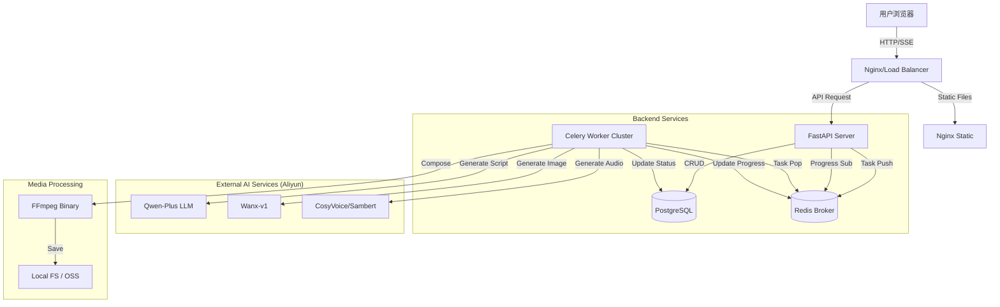

# Marketing2 技术详细设计方案

> **版本**: v1.0
> **状态**: Draft
> **分支**: design/technical-spec

---

## 1. 系统架构设计 (System Architecture)

### 1.1 总体架构 (Micro-Service Monolith)

虽然是单体仓库 (Monorepo)，但在逻辑上采用微服务分层架构，便于未来拆分。

### 1.2 核心组件

1.  **Web Server (FastAPI)**
    *   负责 RESTful API 响应。
    *   负责 SSE (Server-Sent Events) 连接维护，实时推送任务进度。
    *   **不处理**任何耗时超过 500ms 的逻辑。

2.  **Task Queue (Celery)**
    *   **Queue `default`**: 轻量级任务（如数据库清理、简单的状态更新）。
    *   **Queue `ai_generation`**: 调用外部 AI API 的任务（脚本生成、绘图、配音）。需要配置 Rate Limit。
    *   **Queue `video_processing`**: CPU 密集型任务（FFmpeg 渲染）。建议单独部署或分配独立资源。

3.  **Broker & Cache (Redis)**
    *   作为 Celery Broker。
    *   作为 SSE 的 Pub/Sub 通道（Worker -> Redis -> FastAPI -> User）。
    *   缓存高频读取的小说元数据。

4.  **Database (PostgreSQL)**
    *   使用 `JSONB` 存储灵活的分镜数据结构。
    *   利用 PG 的事务特性保证任务状态的一致性。

---

## 2. 数据库设计 (Database Schema)

使用 SQLAlchemy (Async) + Alembic 进行管理。

### 2.1 核心表结构

#### `tasks` (任务主表)
| 字段 | 类型 | 说明 |
|------|------|------|
| id | UUID | 主键 |
| user_id | VARCHAR | 用户ID (预留) |
| type | VARCHAR | 任务类型 (e.g., `one_click_video`) |
| status | ENUM | `pending`, `script_gen`, `media_gen`, `video_render`, `success`, `failed` |
| progress | INT | 总体进度 (0-100) |
| created_at | TIMESTAMP | |
| updated_at | TIMESTAMP | |
| input_params | JSONB | 用户的原始输入 (小说文本, 风格偏好) |
| output_url | VARCHAR | 最终视频地址 |
| error_msg | TEXT | 失败原因 |

#### `scenes` (分镜表 - 核心资产)
| 字段 | 类型 | 说明 |
|------|------|------|
| id | UUID | 主键 |
| task_id | UUID | 外键 -> tasks.id |
| sequence | INT | 排序号 |
| script_text | TEXT | 分镜脚本文字 |
| narration | TEXT | 旁白文字 |
| image_prompt | TEXT | AI 绘图提示词 |
| image_url | VARCHAR | 生成的图片路径 |
| audio_url | VARCHAR | 生成的配音路径 |
| video_url | VARCHAR | 单分镜视频片段路径 |
| duration | FLOAT | 预估/实际时长 (秒) |

---

## 3. 接口设计 (API Specification)

遵循 RESTful 规范。

### 3.1 任务控制
*   `POST /api/v1/workflow/create`: 创建新视频任务
    *   Input: `{ "novel_text": "...", "style": "comic", "voice": "male_01" }`
    *   Output: `{ "task_id": "uuid" }`
*   `GET /api/v1/workflow/{task_id}`: 获取任务详情（包含所有分镜状态）
*   `POST /api/v1/workflow/{task_id}/cancel`: 取消任务

### 3.2 实时流
*   `GET /api/v1/sse/events/{task_id}`
    *   Event Types: `progress`, `log`, `scene_complete`, `error`, `finish`

### 3.3 分镜编辑 (Human-in-the-loop)
*   `PUT /api/v1/scenes/{scene_id}`: 修改分镜内容（如修改提示词、重写旁白）
*   `POST /api/v1/scenes/{scene_id}/regenerate_image`: 重新生成该分镜图片

---

## 4. 核心业务流程 (Core Business Logic)

### 4.1 一键生成 Pipeline

1.  **脚本切分 (Script Breakdown)**
    *   Worker 调用 LLM (Qwen)。
    *   Prompt: "你是一个专业的短视频分镜师。将以下小说片段改编为 6-10 个画面的分镜脚本。输出 JSON 格式，包含：画面描述(prompt)、旁白(narration)、景别(shot_type)。"
    *   Output: List[Scene] -> 存入 DB `scenes` 表。

2.  **并行素材生成 (Parallel Asset Generation)**
    *   **Group 任务**: 为每个 Scene 创建子任务。
    *   **绘图**: 调用 Wanx-v1，传入 `image_prompt` + 风格修饰词 (如 "anime style, 4k, detailed")。
    *   **配音**: 调用 TTS，传入 `narration`。计算音频时长，更新 `scenes.duration`。

3.  **视频合成 (Video Assembly)**
    *   **Ken Burns Effect**: 使用 FFmpeg 对静态图片应用推拉镜头效果 (Zoom in/out/pan)。
    *   **字幕烧录**: 将旁白转为 SRT 字幕并烧录进视频。
    *   **拼接**: 将所有 Scene 的视频片段 concat 为最终 MP4。
    *   **配乐**: (可选) 混入背景音乐。

---

## 5. 异常处理与重试策略

*   **AI API 限流**: 使用 `Tenacity` 库实现指数退避重试 (Exponential Backoff)。
*   **FFmpeg 失败**: 捕获 stderr，提取错误关键帧，允许用户针对该分镜重试。
*   **任务超时**: Celery 设置 `soft_time_limit=600s` (单镜头), `3600s` (全流程)。

## 6. 前端实现建议 (Frontend)

*   **状态管理**: 使用 Pinia Store `useTaskStore` 维护当前任务的完整状态树。
*   **乐观更新**: 修改分镜文字后，本地立即更新 UI，后台异步保存。
*   **播放器**: 使用 `video.js` 或原生 `<video>` 预览生成的片段。

## 7. 部署方案 (Deployment)

*   **Docker Compose**:
    *   `app`: FastAPI
    *   `worker-ai`: Celery (Concurrency: 4)
    *   `worker-video`: Celery (Concurrency: 1, 避免 CPU 抢占)
    *   `redis`: Alpine
    *   `postgres`: Alpine
*   **Volume**: 挂载 `./output` 目录到宿主机，确保生成文件持久化。

---
*Generated by Red (AI Butler) for Marketing2 Project*
