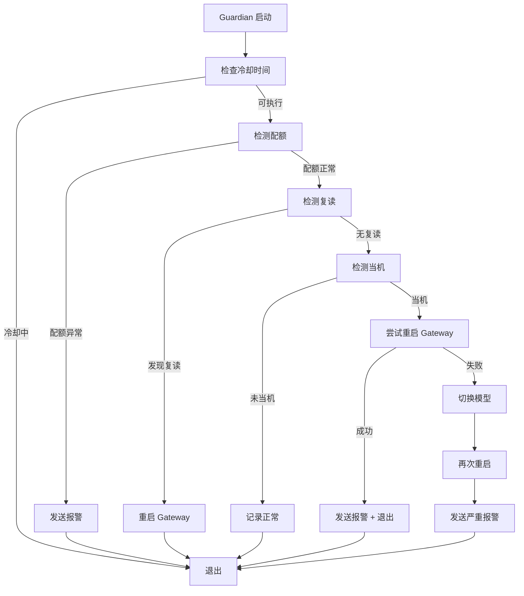

# Guardian - OpenClaw Watchdog Script

Guardian 是一个独立于主进程的守护脚本，用于监控 OpenClaw 代理的健康状态并在检测到异常时自动熔断恢复。

## 功能特性

### 1. **当机检测**
- 监控会话日志，检测用户消息后是否有及时的 AI 回复
- 超时阈值：默认 3 分钟无响应判定为当机
- 自动触发熔断流程

### 2. **配额检测**
- 通过解析 `openclaw status` 输出监控配额使用情况
- 配额达到 75% 时发出警告
- 配额达到 90% 或耗尽时触发报警

### 3. **复读检测**
- 使用 Jaccard 相似度算法检测最近 3 条 AI 回复
- 相似度阈值：0.85（可配置）
- 检测到复读时自动重启 Gateway

### 4. **WhatsApp 报警**
- 支持通过 WhatsApp 发送实时报警通知
- 配置管理员手机号后自动发送关键事件通知
- 包括：当机报警、配额警告、复读检测、模型切换通知

### 5. **智能熔断**
- **第一步**：尝试重启 Gateway
- **第二步**：切换到备用模型
- **第三步**：发送报警并记录状态
- 冷却时间：5 分钟（防止频繁切换）

## 安装与配置

### 1. 环境要求
- Python 3.10+
- OpenClaw CLI 已安装并配置

### 2. 配置文件位置
```
~/.openclaw/workspace/Marketing2/scripts/guardian.py
~/.openclaw/workspace/memory/guardian-state.json  (自动创建)
~/.openclaw/workspace/memory/guardian.log         (自动创建)
```

### 3. 配置 WhatsApp 报警（可选）
设置环境变量指定管理员手机号：
```bash
export GUARDIAN_ADMIN_PHONE="+8613800138000"
```

或在脚本中直接修改：
```python
WHATSAPP_ADMIN = "+8613800138000"
```

### 4. 修改配置参数（可选）
打开 `guardian.py`，根据需要调整以下参数：

```python
TIMEOUT_MINUTES = 3           # 当机检测超时（分钟）
COOLDOWN_MINUTES = 5          # 熔断冷却时间（分钟）
SIMILARITY_THRESHOLD = 0.85   # 复读检测相似度阈值（0-1）
RECENT_MESSAGES_COUNT = 3     # 检测最近N条消息

# 模型备用列表（按优先级）
MODEL_FALLBACK_ORDER = [
    "google-antigravity/claude-opus-4-5-thinking",
    "google-antigravity/gemini-3-pro-high",
    "google-antigravity/gemini-3-flash",
    "minimax-portal/MiniMax-M2.1",
    "glm/glm-4.7",
]
```

## 使用方法

### 方式一：手动执行
```bash
chmod +x ~/,openclaw/workspace/Marketing2/scripts/guardian.py
python3 ~/.openclaw/workspace/Marketing2/scripts/guardian.py
```

### 方式二：添加到 Crontab（推荐）
每分钟执行一次监控：
```bash
crontab -e
```

添加以下行：
```cron
* * * * * /usr/bin/python3 /home/admin/.openclaw/workspace/Marketing2/scripts/guardian.py
```

### 方式三：使用 systemd timer（可选）
创建服务文件：
```bash
sudo nano /etc/systemd/system/guardian.service
```

内容：
```ini
[Unit]
Description=OpenClaw Guardian Watchdog
After=network.target

[Service]
Type=oneshot
User=admin
Environment="GUARDIAN_ADMIN_PHONE=+8613800138000"
ExecStart=/usr/bin/python3 /home/admin/.openclaw/workspace/Marketing2/scripts/guardian.py
```

创建定时器：
```bash
sudo nano /etc/systemd/system/guardian.timer
```

内容：
```ini
[Unit]
Description=Run Guardian every minute

[Timer]
OnBootSec=1min
OnUnitActiveSec=1min

[Install]
WantedBy=timers.target
```

启用定时器：
```bash
sudo systemctl daemon-reload
sudo systemctl enable guardian.timer
sudo systemctl start guardian.timer
```

## 日志与状态

### 查看日志
```bash
tail -f ~/.openclaw/workspace/memory/guardian.log
```

日志格式：
```
[2026-02-03 15:30:00] [INFO] Guardian check started
[2026-02-03 15:30:01] [INFO] Agent is responsive, all good!
[2026-02-03 15:35:00] [ERROR] FROZEN DETECTED: User message at 2026-02-03 15:32:00, no AI reply for 3.2 minutes
[2026-02-03 15:35:02] [WARN] Gateway restarted successfully.
```

### 状态文件
Guardian 会维护一个状态文件记录运行统计：
```json
{
  "last_action_time": 1738574100,
  "current_model_index": 0,
  "restart_count": 5,
  "switch_count": 2,
  "quota_warnings": 1,
  "repeat_detections": 0
}
```

## 工作流程



## 故障排查

### Guardian 未运行
1. 检查 crontab 配置：`crontab -l`
2. 查看系统日志：`grep CRON /var/log/syslog`
3. 手动执行测试：`python3 guardian.py`

### 报警未发送
1. 检查环境变量：`echo $GUARDIAN_ADMIN_PHONE`
2. 测试 OpenClaw CLI：`openclaw message send --help`
3. 查看 Guardian 日志中的错误信息

### 误报当机
1. 增加 `TIMEOUT_MINUTES` 参数（例如改为 5）
2. 检查会话日志格式是否发生变化
3. 查看日志确认最后消息时间

## 最佳实践

1. **定期检查日志**：每周查看一次 `guardian.log`，了解代理健康状况
2. **调整阈值**：根据实际使用情况调整超时时间和相似度阈值
3. **配置报警**：设置 WhatsApp 报警以便及时响应问题
4. **模型优先级**：根据性能和配额调整 `MODEL_FALLBACK_ORDER` 列表
5. **监控配额**：定期查看配额使用情况，避免突然耗尽

## 版本历史

- **v1.1.0** (2026-02-03)
  - ✨ 新增配额检测功能
  - ✨ 新增复读检测（Jaccard 相似度）
  - ✨ 新增 WhatsApp 报警功能
  - 🎨 优化日志输出（带级别标记）
  - 📝 完善文档和注释

- **v1.0.0** (Initial)
  - ✅ 基础当机检测
  - ✅ Gateway 重启功能
  - ✅ 模型切换功能

## License

MIT

## 贡献

欢迎提交 Issue 和 Pull Request！

---

**维护者**: Red Building Team  
**最后更新**: 2026-02-03
